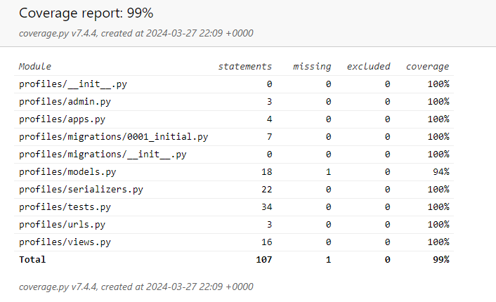
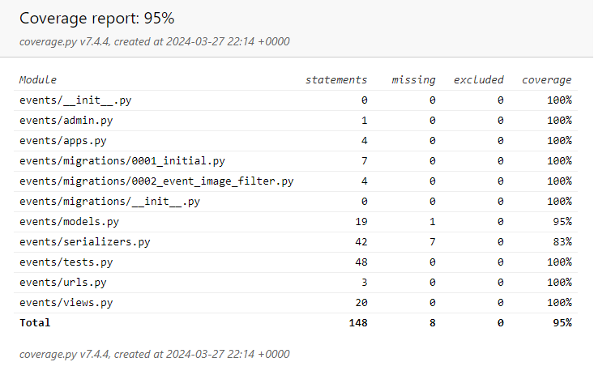

# **OAA API Testing**

## Table of Contents

* [**Testing**](<#testing>)
    * [Code Validation](<#code-validation>)
    * [Automated Testing](<#automated-testing>)
    * [Manual Testing](<#manual-testing>)
    * [Known Bugs](<#known-bugs>)

## Code Validation 

### PEP8

The Python used to develop the OAA (Out & About) API has been passed through the [PEP8 Code Institute Linter]( https://pep8ci.herokuapp.com/) in order to provide validation. The only errors noted across the various files were invalid white spaces, spacing for classes and line length being too long. These errors were corrected in order that the linter will now return the following:
 
### OAA_api files

* permissions.py - No problems or warnings found
* serializers.py - No problems or warnings found
* views.py - No problems or warnings found
* models.py - No problems or warnings found
* urls.py - No problems or warnings found

### Comments App py files

* models.py - No problems or warnings found
* serializers.py - No problems or warnings found
* tests.py - No problems or warnings found
* urls.py - No problems or warnings found
* views.py - No problems or warnings found

### Contact App py files

* models.py - No problems or warnings found
* serializers.py - No problems or warnings found
* tests.py - No problems or warnings found
* urls.py - No problems or warnings found
* views.py - No problems or warnings found

### Events App py files

* models.py - No problems or warnings found
* serializers.py - No problems or warnings found
* tests.py - No problems or warnings found
* urls.py - No problems or warnings found
* views.py - No problems or warnings found

### Subscribers App py files

* models.py - No problems or warnings found
* serializers.py - No problems or warnings found
* tests.py - No problems or warnings found
* urls.py - No problems or warnings found
* views.py - No problems or warnings found

### Attending App py files

* models.py - No problems or warnings found
* serializers.py - No problems or warnings found
* tests.py - No problems or warnings found
* urls.py - No problems or warnings found
* views.py - No problems or warnings found

### Profiles App py files

* models.py - No problems or warnings found
* serializers.py - No problems or warnings found
* tests.py - No problems or warnings found
* urls.py - No problems or warnings found
* views.py - No problems or warnings found

### Reviews App py files

* models.py - No problems or warnings found
* serializers.py - No problems or warnings found
* tests.py - No problems or warnings found
* urls.py - No problems or warnings found
* views.py - No problems or warnings found

## Automated Testing

The following automatic tests have been written into the OAA API, in order to cover the user story scenarios for Events and Profiles. These are the tests that were created: 

|           **Profiles**                         | Status
|:----------------------------------------------:|:-------:|
| Profile automatically created on user creation | &check; 
| Can list profiles                              | &check; 
| Can retrieve profile using valid ID            | &check; 
| Can't retrieve profile using invalid ID        | &check; 
| Can update own profile                         | &check; 
| Can't update someone else's profile            | &check; 

### Coverage Report

|           **Events**                  | Status
|:-------------------------------------:|:-------:|
| Can list events                       | &check; 
| Logged in user can create event       | &check; 
| Logged out user can't create event    | &check; 
| Can retrieve event using valid ID     | &check; 
| Can't retrieve event using invalid ID | &check; 
| Can update own event                  | &check; 
| Can't update someone else's event     | &check; 

### Coverage Report

Time constraints during development did not allow for the development of full, comprehensive automated testing to be written for all apps and features so this will be completed in future.

## Manual Testing

The following manual testing was carried out in addition to the automated testing:

| Status | **Profiles**
|:-------:|:--------|
| &check; | Profile List can be ordered by events_count in ascending order
| &check; | Profile List can be ordered by events_count in descending order
| &check; | Profile List can be ordered by subscribers_count in ascending order
| &check; | Profile List can be ordered by subscribers_count in descending order
| &check; | Profile List can be ordered by subscribing_count in ascending order
| &check; | Profile List can be ordered by subscribing _count in descending order
| &check; | Profile List can be ordered by owner__subscribing__created_at in ascending order
| &check; | Profile List can be ordered by owner__ subscribing __created_at in descending order
| &check; | Profile List can be ordered by owner__subscribed__created_at in ascending order
| &check; | Profile List can be ordered by owner__ subscribed __created_at in descending order

| Status | **Events**
|:-------:|:--------|
| &check; | Event List can be ordered by comments_count in ascending order
| &check; | Event List can be ordered by comments_count in descending order
| &check; | Event List can be ordered by attending_count in ascending order
| &check; | Event List can be ordered by attending_count in descending order
| &check; | Event List can be ordered by average_rating in ascending order
| &check; | Event List can be ordered by average_rating in descending order
| &check; | Event List can be ordered by attendin __created_at in ascending order
| &check; | Event List can be ordered by attending__created_at in descending order
| &check; | Event List can be searched on by owner 'johnny'
| &check; | Event List can be searched on by title ‘test’
| &check; | Event List can be filtered by category

| Status | **Comments**
|:-------:|:--------|
| &check; | Comment List can be filtered by event

| Status | **Reviews**
|:-------:|:--------|
| &check; | Review List can be filtered by event

| Status | **Contact**
|:-------:|:--------|
| &check; | User can create a contact message

## Known Bugs

### Resolved

1. When running APITestcase for events the tests kept failing with an Integrity Error: Not Null Constraint. It was realised that event_date was required with a placeholder as this is a required field. It was further realised that the date had to be YYYY-MM-DD in order for the tests to build and pass.
2. There is a known invalid name label for the filters in DRF so this was accounted for during production.
3. There is a known dj-rest-auth Bug that was fixed by creating a logout view, where both cookies set to an empty string and pass additional attributes to fix.

Click [**_here_**](README.md) to return to the README.
